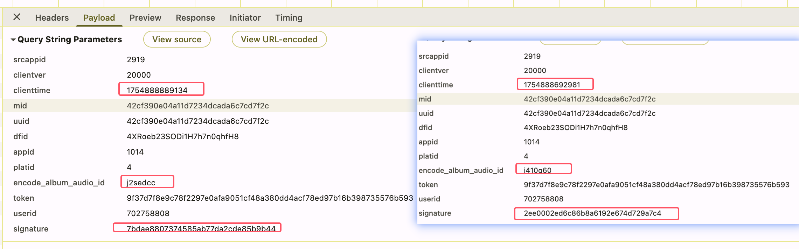
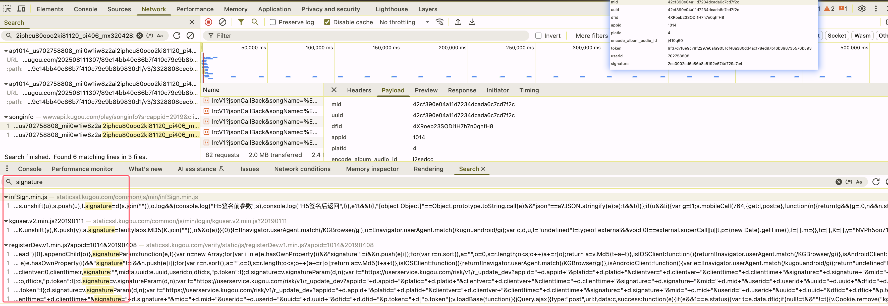
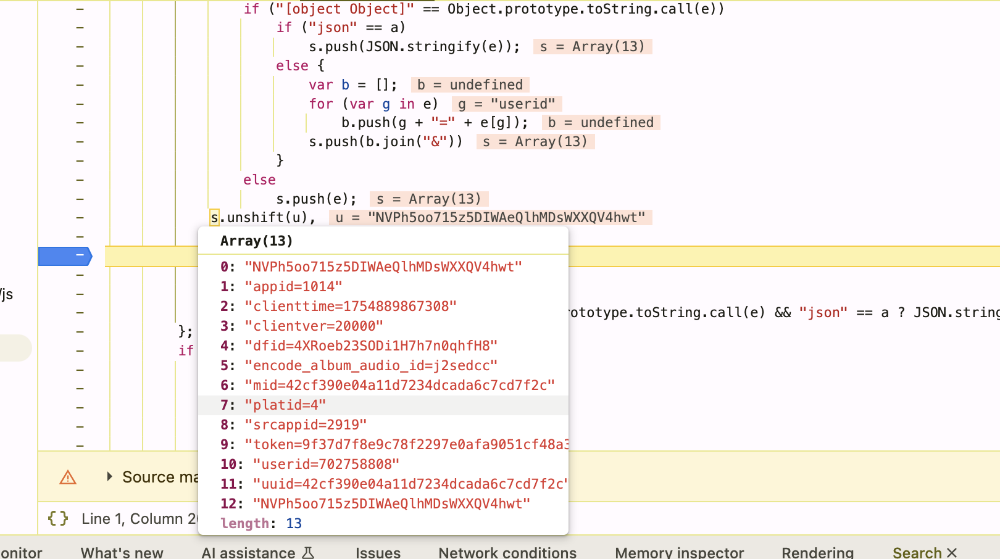
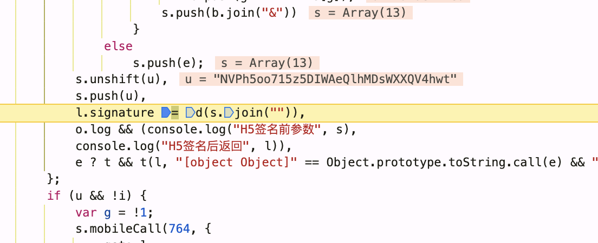

#### 酷狗批量采集流程

###### 1、对比生成两个歌曲播放链接的请求参数，这里采用 '晴天、花海'两首歌进行对比

- 晴天

```js
// 生成歌曲播放链接的完整URL
// https://wwwapi.kugou.com/play/songinfo?srcappid=2919&clientver=20000&clienttime=1754799071661&mid=42cf390e04a11d7234dcada6c7cd7f2c&uuid=42cf390e04a11d7234dcada6c7cd7f2c&dfid=4XRoeb23SODi1H7h7n0qhfH8&appid=1014&platid=4&encode_album_audio_id=j410q60&token=9f37d7f8e9c78f2297e0afa9051cf48ae823833b074e526780bfd69807857eb7&userid=702758808&signature=9e94615ff3bcdd237b43423f70a0b5a9
// 拆分成params对象后
const url = https://wwwapi.kugou.com/play/songinfo
const params = {
  srcappid:'2919'
  clientver:'20000'
  clienttime:'1754888692981'
  mid:'42cf390e04a11d7234dcada6c7cd7f2c'
  uuid:'42cf390e04a11d7234dcada6c7cd7f2c'
  dfid:'4XRoeb23SODi1H7h7n0qhfH8'
  appid:'1014'
  platid:'4'
  encode_album_audio_id:'j410q60'
  token:'9f37d7f8e9c78f2297e0afa9051cf48a380dd4acf78ed97b16b398735576b593'
  userid:'702758808'
  signature:'2ee0002ed6c86b8a6192e674d729a7c4'
}
```

- 花海

```js
// 生成歌曲播放链接的完整URL
// https://wwwapi.kugou.com/play/songinfo?srcappid=2919&clientver=20000&clienttime=1754888889134&mid=42cf390e04a11d7234dcada6c7cd7f2c&uuid=42cf390e04a11d7234dcada6c7cd7f2c&dfid=4XRoeb23SODi1H7h7n0qhfH8&appid=1014&platid=4&encode_album_audio_id=j2sedcc&token=9f37d7f8e9c78f2297e0afa9051cf48a380dd4acf78ed97b16b398735576b593&userid=702758808&signature=7bdae8807374585ab77da2cde85b9b44
// 拆分成params对象后
const url = https://wwwapi.kugou.com/play/songinfo
const params = {
  srcappid:'2919'
  clientver:'20000'
  clienttime:'1754888889134'
  mid:'42cf390e04a11d7234dcada6c7cd7f2c'
  uuid:'42cf390e04a11d7234dcada6c7cd7f2c'
  dfid:'4XRoeb23SODi1H7h7n0qhfH8'
  appid:'1014'
  platid:'4'
  encode_album_audio_id:'j2sedcc'
  token:'9f37d7f8e9c78f2297e0afa9051cf48a380dd4acf78ed97b16b398735576b593'
  userid:'702758808'
  signature:'7bdae8807374585ab77da2cde85b9b44'
}
```

分解结果(查看不同的部分)：


- clienttime(请求时间-可手动构建)
- encode_album_audio_id(歌曲 id，能获取)
- signature(签名，需要逆向获取)

###### 2.逆向获取- signature 生成过程

同样搜索关键词'signature'，在代码处打上断点查看是如何生成该参数的信息


debugger 后获取到了参数生成的地方：


一个`d`方法生成的，并且参数传入了一个`数组`，再仔细查看数组，可以发现和我们上面两个歌曲中`params`参数一模一样，只是去除了`signature`在前后加了一个字符串`NVPh5oo715z5DIWAeQlhMDsWXXQV4hwt`

:rocket: 特别分析，根据`signature`可以大胆猜想是`MD5`加密

###### 由此可以使用 python 代码替换生成`signature`的方法
